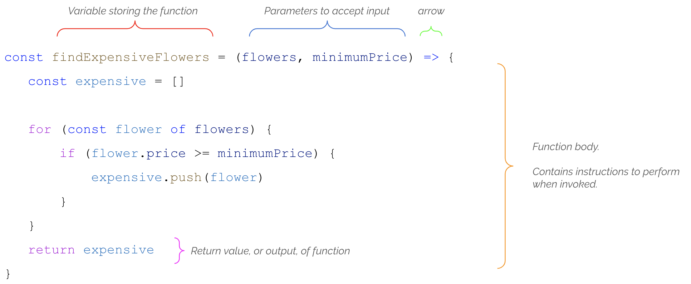

## The Flow of Using Functions



The flow of using functions, sending data to them, capturing the data they return, and then sending that data somewhere else will be a challenge for you. Therefore, in this exercise, you are going to practice that flow.

Here's an example of two tasks. One task depends on what the other outputs, or **returns**.

This function defines the task of making an object representation of a chair. It has one parameter defined `chairMaterial` so that the chair can be	made of any type of material that you specify.
```js
const yellowChairMaker = (chairMaterial) => {
	const chairObject = {
		type: "Chair",
		color: "Yellow",
		material: chairMaterial,
		price: 49.29
	}

	return chairObject
}

// Now you can invoke the function - or start the task - to make two chairs.
const metalChair = yellowChairMaker("Aluminum")
const oakChair = yellowChairMaker("Oak")
```

You now have two objects. They are each assigned to a variable so that you can reference them later in the code.

Here's the aluminum chair.

```js
console.log(metalChair)

> {
	type: "Chair",
	color: "Yellow",
	material: "Aluminum",
	price: 49.29
}
```

Here's the oak chair.

```js
console.log(oakChair)

> {
	type: "Chair",
	color: "Yellow",
	material: "Oak",
	price: 49.29
}
```

Using those objects, you want to produce a human-readable string so that it can be put on a website for sale. For example...

```html
The Yellow, Oak Chair costs $49.29
The Yellow, Aluminum Chair costs $49.29
```

Using the object to produce a string is a task. Therefore, as a responsible software developers, you would create a function to perform that task.

```js
/*
	Vocabulary:
		- `chairObject` is a parameter. It can only be used inside the function.
		- `chairStringMaker` is a variable whose value is a function
		- `stringRepresentation` is an internal variable for the function.
			It, also, can only be used inside the function, not outside it.
*/
const chairStringMaker = (chairObject) => {
	// Note that the last interpolation has two dollar signs.
	// The first one is just a dollar sign. The second is for the interpolation.
	const stringRepresentation = `The ${chairObject.color}, ${chairObject.material} ${chairObject.type} costs $${chairObject.price}`

	return stringRepresentation
}
```

In this scenario, the _chairStringMaker()_ function can't operate alone. It needs an object to do its job. It is the responsibility of _yellowChairMaker()_ to make an object. Here's the flow of how this code works.

1. yellowChairMaker function is invoked and provided a string as an argument
2. yellowChairMaker makes an object and returns it
3. The object is captured in a variable
4. chairStringMaker function is invoked and provided an object as an argument by putting the variable from step 3 in the parenthesis.
5. chairStringMaker creates a string representation of the object and returns it
6. The string is captured in a variable

## The Final Code

So the functions are defined first, and then they are invoked to the tasks can be performed.

```js
const yellowChairMaker = (chairMaterial) => {
	const chairObject = {
		type: "Chair",
		color: "Yellow",
		material: chairMaterial,
		price: 49.29
	}

	return chairObject
}

const chairStringMaker = (chairObject) => {
	const stringRepresentation = `The ${chairObject.color}, ${chairObject.material} ${chairObject.type} costs ${chairObject.price}`

	return stringRepresentation
}

const returnedChairObject = yellowChairMaker("Oak")
// At this moment, the returnedChairObject variable has an object as its value

const returnedChairString.= chairStringMaker(returnedChairObject)
// At this moment, the returnedChairString variable has a string as its value

console.log(returnedChairString)
> "The Yellow, Oak Chair costs $49.29"
```

The chairStringMaker function **depends on** the yellowChairMaker function doing its job first.

## Practice: Wood Carving

### Setup

```sh
cd
cd workspace
mkdir functions-carving
cd functions-carving
touch main.js
code .
```

Once VS Code starts, open the `main.js` file and follow the instructions below.

### Instructions

Here are two functions you can start with. The second one will depend on what the first one returns.

```js
const createWoodBlock = () => {
    // Return an object with 4 properties.

}

const createBeautifulCarving = (woodObject) => {
    // Return a string representation of the object

}

// The function returns a value, so that value is stored in a variable
const woodBlock = createWoodBlock()

// The function returns a value, so that value is stored in a variable
const carvingString = createBeautifulCarving()  // <-- Missing an argument. Fix it.

console.log(carvingString)
```

In the **createWoodBlock** function, return an object with the following properties

* A _type_ property with a value of "wood block"
* A _length_ property with a value of 10
* A _material_ property with a value of "pine"
* A _purpose_ property with a value of "flute"

In the **createBeautifulCarving** function, return a string that looks like the following template.

"The 10-inch, pine woodblock was carved into a wooden flute"

#### Helpful hints

You can expand the hints below if you are stuck and don't know what to do. Make sure you try a few times and fail, and then talk with your teammates before looking at the hints.

<details>
<summary>Hint: Wood block</summary>

```js
const createWoodBlock = () => {
    // Return an object with 4 properties.
    return {
        type: "wood block",
        length: 10,
        material: "pine",
        purpose: "flute"
    }
}
```

</details>

<details>
<summary>Hint: Wood carving</summary>

```js
const createWoodBlock = (woodBlock) => {
    // Return an object with 4 properties.
    return `The ${woodBlock.length}-inch, ${woodBlock.material} woodblock was carved into a wooden ${woodBlock.purpose}`
}
```

</details>
