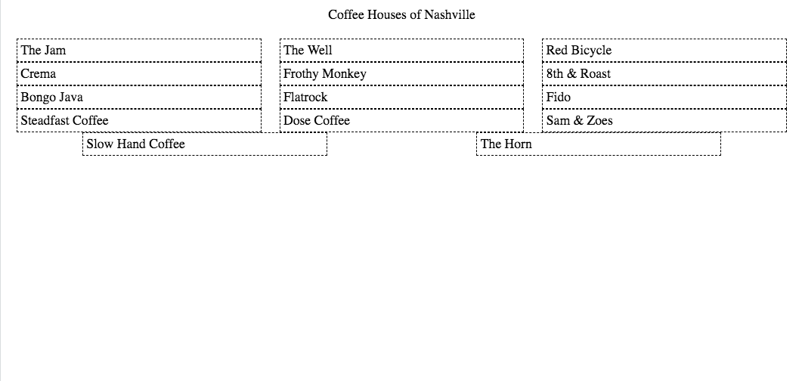

# Coffee Houses of Nashville

> The learning objective for this practice exercise is to use `display:flex` on a list component, and then add additional CSS properties to achieve a desired layout.

## Getting Started

## Getting Started

1. Make a new project directory in workspace
    ```sh
    cd ~/workspace
    mkdir coffee-houses
    ```
2. Navigate to your project directory
    ```sh
    cd coffee-houses
    ```
3. Type in the `git init` command
4. You now have a git repository for tracking your progress


## Boilerplate Code

1. Create an `index.html` file in your project directory and paste the following code into it.
   <details>
      <summary>Expand to get the HTML</summary>

   ```html
   <!DOCTYPE html>
   <html lang="en">
     <head>
       <title>Nashville Coffee Houses</title>
       <link rel="stylesheet" href="styles/main.css">
     </head>
     <body>
   	<header class="pageHeader">Coffee Houses of Nashville</header>

       <section class="list">
         <article class="shop">The Jam</article>
         <article class="shop">The Well</article>
         <article class="shop">Red Bicycle</article>
         <article class="shop">Crema</article>
         <article class="shop">Frothy Monkey</article>
         <article class="shop">8th &amp; Roast</article>
         <article class="shop">Bongo Java</article>
         <article class="shop">Flatrock</article>
         <article class="shop">Fido</article>
         <article class="shop">Steadfast Coffee</article>
         <article class="shop">Dose Coffee</article>
         <article class="shop">Sam &amp; Zoes</article>
         <article class="shop">Slow Hand Coffee</article>
         <article class="shop">The Horn</article>
       </section>
     </body>
   </html>
   ```
   </details>
2. Add a sub-directory in your project named **styles**.
3. Create a `main.css` file in the **styles** directory.
4. In the **coffee-houses** directory in your terminal, run the `serve` command to start your web server. Make sure you are not in your **styles** directory when you do this. Also make sure you are not in your **workspace** directory.

After you run `serve` a URL will be displayed in your terminal. Copy pasta that URL into your browser.

```sh
   ┌────────────────────────────────────────────────────┐
   │                                                    │
   │   Serving!                                         │
   │                                                    │
   │   - Local:            http://localhost:3000        │
   │   - On Your Network:  http://192.168.68.113:3000   │
   │                                                    │
   │   Copied local address to clipboard!               │
   │                                                    │
   └────────────────────────────────────────────────────┘
```

If this doesn't work for you, the initial installations may not have worked correctly. Run the following commands in your terminal and see if you can run **serve** afterwards.

```sh
npm config set prefix $HOME/.npm-packages
echo 'export PATH="$PATH:$HOME/.npm-packages/bin"' >> $HOME/.profile
source $HOME/.profile &> profile-reload.log
npm i -g serve json-server >> /dev/null 2>> error.log
```

## Description

With the provided HTML, use the syntax of Flexbox in your CSS file to achieve the layout below.

> You don't need to add the border to each coffee house component, but you can if you like. It's been added in this example to highlight the alignment and spacing you're shooting for.




## Additional References

This is supplementary content. It is not required, but is for your additional learning if you wish.

1. [HTML Semantic Tag Cheatsheet](https://learn-the-web.algonquindesign.ca/topics/html-semantics-cheat-sheet/)
1. [CSS Tricks - Flexbox](https://css-tricks.com/snippets/css/a-guide-to-flexbox/)
1. [CSS Tricks - BEM](https://css-tricks.com/bem-101/)
1. [Introduction to BEM - A front-end methodology](https://www.youtube.com/watch?v=IO-4Z32O--c)
