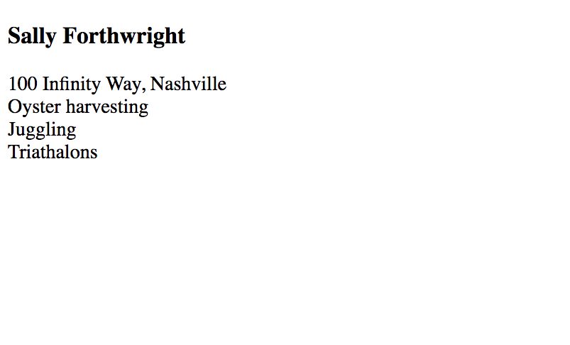
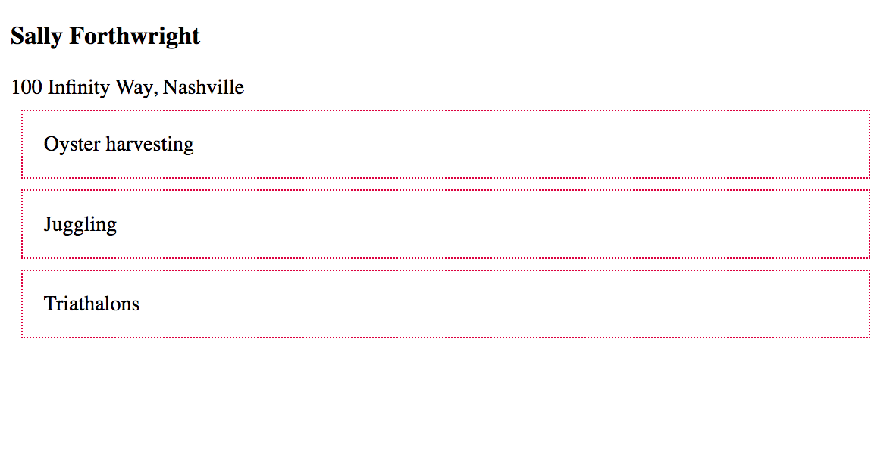
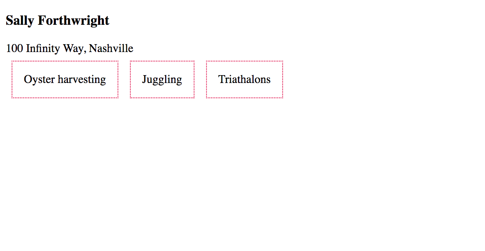
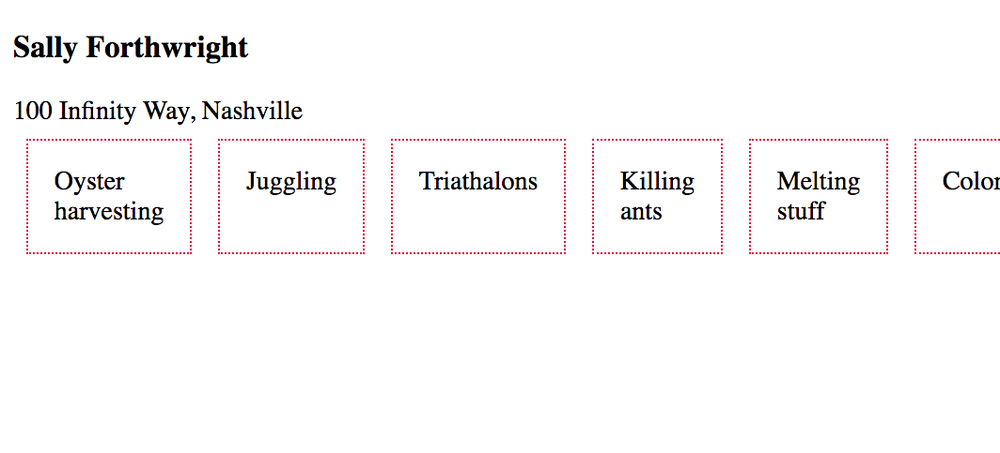
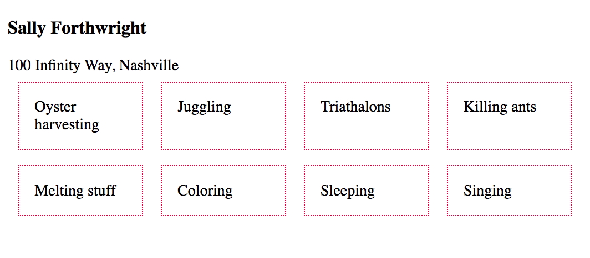

# HTML Components

## Why Are You Learning This?

Thinking of applications and web page as a collection of independent components is the foundation of modern web applications that you use all the time.

* Snapchat
* Instagram
* Twitter
* Facebook
* Etsy
* Pinterest

All of these applications are written by teams of software developers who define the individual components that are used throughout their application. They then write each component separately and then compose them in interesting ways and make them work together.

## Visual Review of Semantic Elements

What is a component and how do HTML elements apply to the concept? Look at the image below to see an overview of semantic HTML elements and how they are intended to be used together.


## CSS Naming Conventions

Styling components intelligently can be handled through naming your classes according to the component name. One popular convention is the [BEM method](http://getbem.com/introduction/).

If you were creating an HTML component that represents you, here's an example of how the code would look using HTML semantic elements and BEM class names. Copy and paste this code in the **index.html** file of **sallys-interests**.

```html
<!DOCTYPE html>
<html lang="en">
<head>
    <meta charset="UTF-8">
    <meta name="viewport" content="width=device-width, initial-scale=1.0">
    <link rel="stylesheet" href="styles/main.css" />
    <title>Sally's Interests</title>
</head>
<body>
    <main>
        <!-- Parent biography component -->
        <article class="bio">
    
            <!-- Child biography component -->
            <section class="bio__name">
                <h1>Sally Forthwright</h1>
            </section>
    
            <!-- Child biography component -->
            <section class="bio__address">
                100 Infinity Way, Nashville
            </section>
    
            <!-- Child biography component -->
            <section class="bio__interests">
                <div class="interest">
                    Oyster harvesting
                </div>
                <div class="interest">
                    Juggling
                </div>
                <div class="interest">
                    Triathlons
                </div>
            </section>
    
        </article>
    </main>
</body>
</html>
```

Each of those components can be styled individually with a clear, concise name that also provides some semantic context when looking at the CSS file. Before you style them, all you have is structure as some very basic, default styles that the browser applies to your elements.

In the **sallys-interests** directory in your terminal, run the `serve` command to start your web server. Make sure you are not in your **styles** directory when you do this. Also make sure you are not in your **workspace** directory.

After you run `serve` a URL will be displayed in your terminal. Copy pasta that URL into your browser.

```sh
   ┌────────────────────────────────────────────────────┐
   │                                                    │
   │   Serving!                                         │
   │                                                    │
   │   - Local:            http://localhost:3000        │
   │   - On Your Network:  http://192.168.68.113:3000   │
   │                                                    │
   │   Copied local address to clipboard!               │
   │                                                    │
   └────────────────────────────────────────────────────┘
```

If this doesn't work for you, the initial installations may not have worked correctly. Run the following commands in your terminal and see if you can run **serve** afterwards.

```sh
npm config set prefix $HOME/.npm-packages
echo 'export PATH="$PATH:$HOME/.npm-packages/bin"' >> $HOME/.profile
source $HOME/.profile &> profile-reload.log
npm i -g serve json-server >> /dev/null 2>> error.log
```



Now you can style any HTML component with a class of `interest` and they will all look the same.

```css
.interest {
    border: 1px dotted crimson;
    padding: 1em;
    margin: 0.5em;
}
```



## Grid Layout with Flexbox

Flexbox is a tool that you can use in CSS to take the structure of your HTML and apply interesting layouts for it. One of the most common layout types is a grid, and it's straightforward to do with Flexbox.

Unfortunately, these Flexbox properties are hard to remember, so you should come back to this chapter and review them whenever you need to use Flexbox to make a grid layout.

You want those three interests to be all in the same row instead of each one being an entire row all by itself. The first thing you need to do is apply a style to the component in which all of those interests are contained. In your case, it's the `<section class="bio__interests">` component.

```css
.bio__interests {
    display: flex;  /* Display the child items in a Flex layout */
}
```



The `display: flex` property on a parent component immediately creates a row and puts all of the child elements in it. However, you're not quite done.

Add some more interests for Sally.

```html
<div class="interest">
    Killing ants
</div>
<div class="interest">
    Melting stuff
</div>
<div class="interest">
    Coloring
</div>
<div class="interest">
    Sleeping
</div>
<div class="interest">
    Singing
</div>
```



The default behavior is to put **all** child components into a single row, so you eventually run out of room if there are too many. You need to tell the browser that you want it to figure out how many can fit in a row and to create a new row when there's no more room.

```css
.bio__interests {
    display: flex;
    flex-wrap: wrap;  /* Let the rows wrap if there are too many */
}
```


Close, but you may not like that the rows are not aligned. The browser stops at figuring out how many will fit in the row. You have to provide the instructions for how to align them.

```css
.bio__interests {
    display: flex;
    flex-wrap: wrap;
    justify-content: space-evenly; /* Evenly space the child elements */
}
```


Sooooooo close, but the boxes aren't all the same size which is distracting noise to the human brain. We find it much more pleasing when things line up evenly.

```css
.interest {
    flex-basis: 16%;  /* Make each child element the same width */
    border: 1px dotted crimson;
    padding: 1em;
    margin: 0.5em;
}
```



The final touch is to center align the text in each of the interest boxes.

```css
.interest {
    flex-basis: 16%;
    border: 1px dotted crimson;
    padding: 1em;
    margin: 0.5em;
    text-align: center; /* Center align the text in the boxes */
}
```


## Additional References

This is supplementary content. It is not required, but is for your additional learning if you wish.

1. [HTML Semantic Tag Cheatsheet](https://learn-the-web.algonquindesign.ca/topics/html-semantics-cheat-sheet/)
1. [CSS Tricks - Flexbox](https://css-tricks.com/snippets/css/a-guide-to-flexbox/)
1. [CSS Tricks - BEM](https://css-tricks.com/bem-101/)
1. [Introduction to BEM - A front-end methodology](https://www.youtube.com/watch?v=IO-4Z32O--c)
