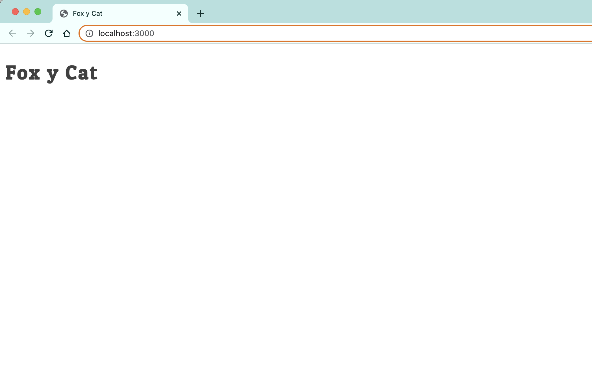

# Fox y Cat Project Setup

In your workspace directory, create a new project directory.

```sh
mkdir fox-y-cat
cd fox-y-cat
```

Then create your HTML file, a main CSS file, and a main JavaScript file.

```sh
touch index.html
mkdir styles
touch styles/main.css
mkdir scripts
touch scripts/main.js
```

## HTML

Copy pasta the following code into your HTML file. As you can see, there is just a header, and a main element that contains two image elements with no URL for a source yet. You will be updating those dynamically after you fetch some URLs from

```html
<!doctype html>
<html lang="en">
    <head>
        <meta charset="utf-8">
        <title>Fox y Cat</title>
        <link rel="stylesheet" href="./styles/main.css">
    </head>

    <body>
        <h1>Fox y Cat</h1>
        <main id="container">
            
            
        </main>

        <script type="module" src="./scripts/main.js"></script>
    </body>
</html>
```

Then run the `serve` command in your terminal and open the URL in your browser. You should see just the header.



On to the next chapter to write your first `fetch()` function to get remote data from the Web.
